# Restaurant Management

Providing food and drink services to guests in hotels and restaurants, showing attentiveness, and understanding of their needs and expectations.

## Sneak Peek for Staff
<p align="center">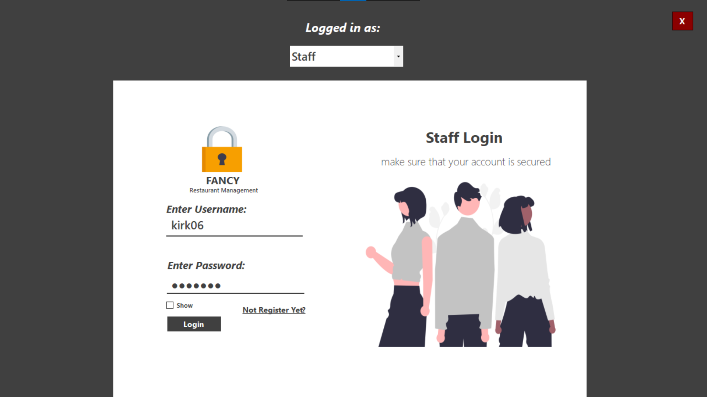&nbsp;&nbsp;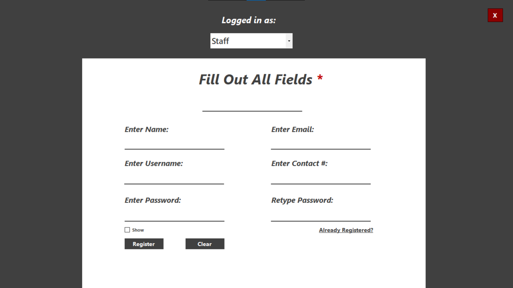&nbsp;&nbsp;</p>
<p align="center">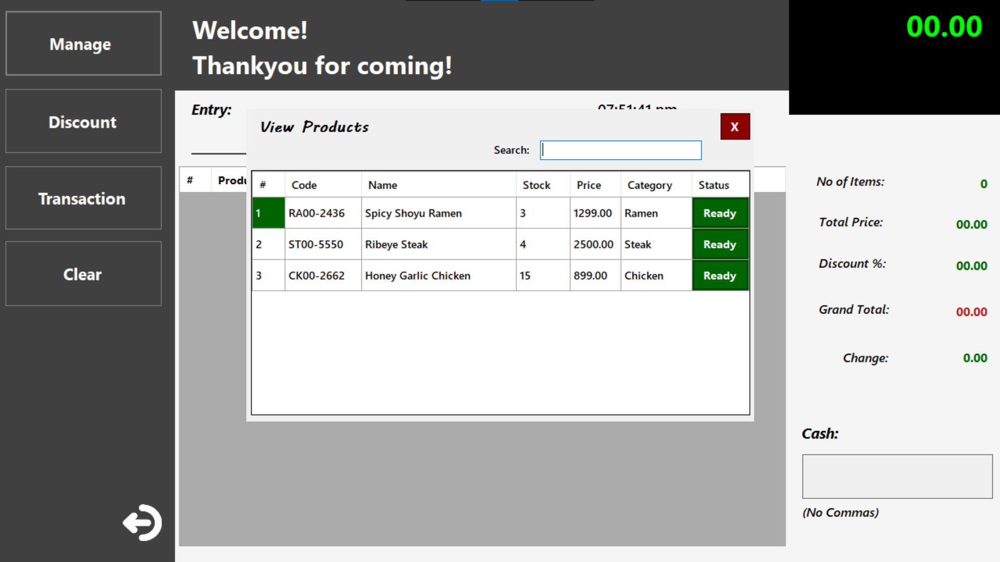&nbsp;&nbsp;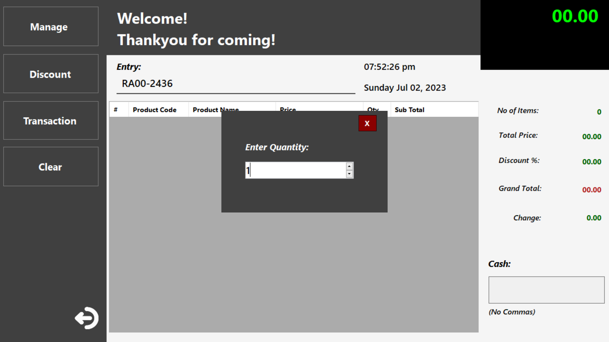</p>
<p align="center">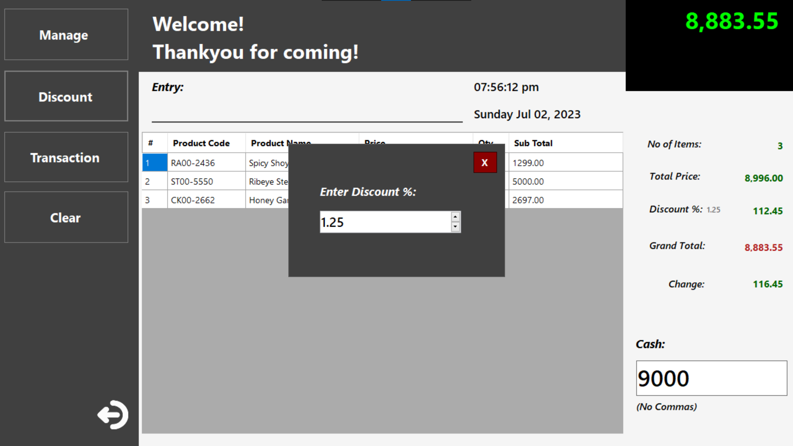&nbsp;&nbsp;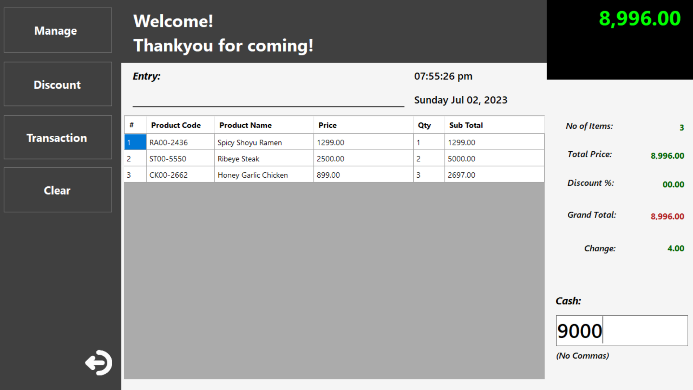</p>
<p align="center">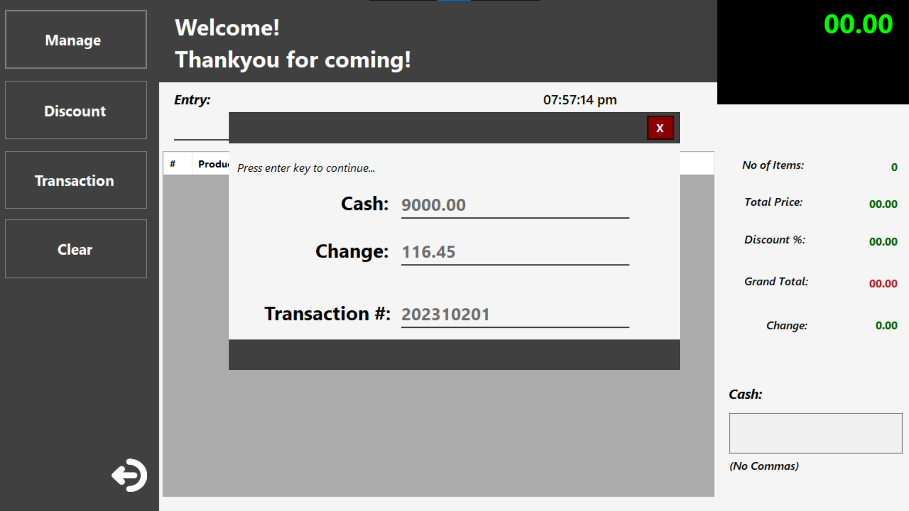&nbsp;&nbsp;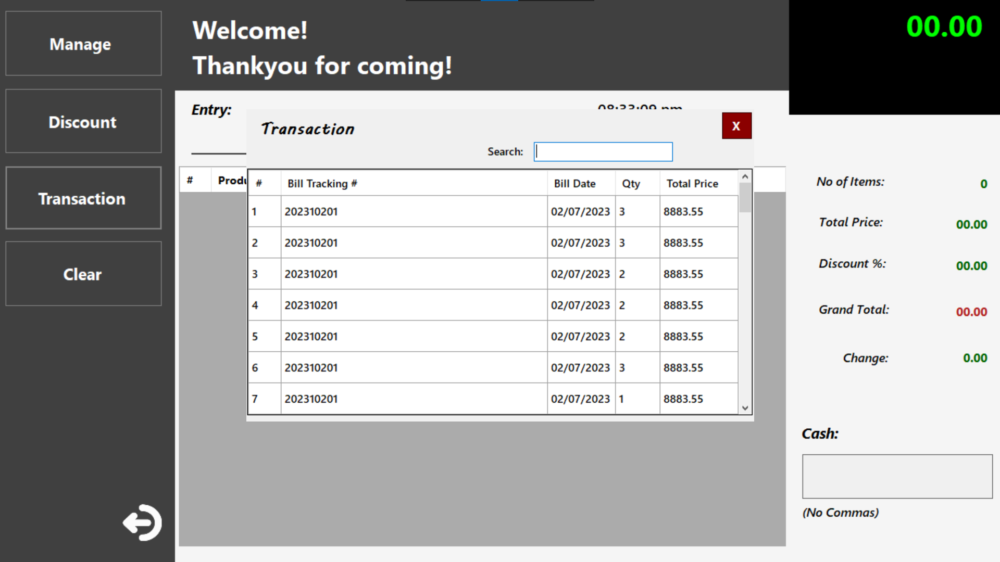</p>

## Sneak Peek for Admin
<p align="center">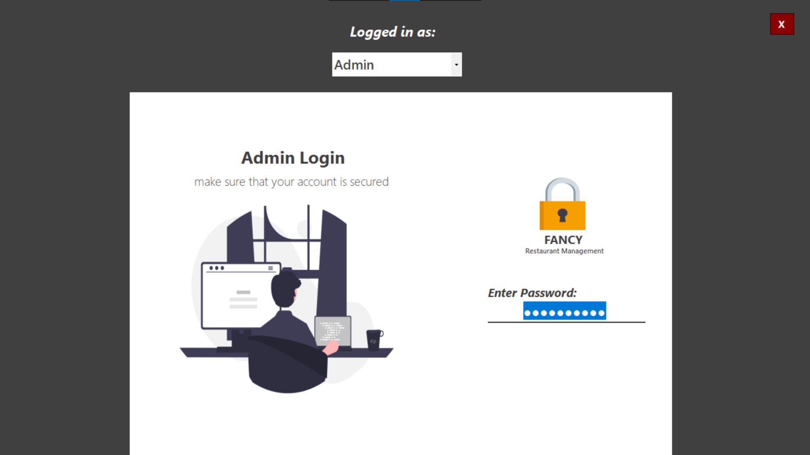&nbsp;&nbsp;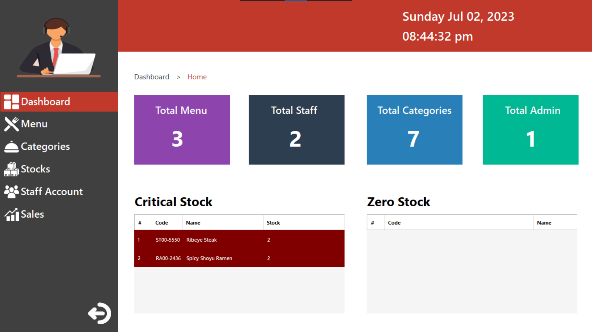&nbsp;&nbsp;</p>
<p align="center">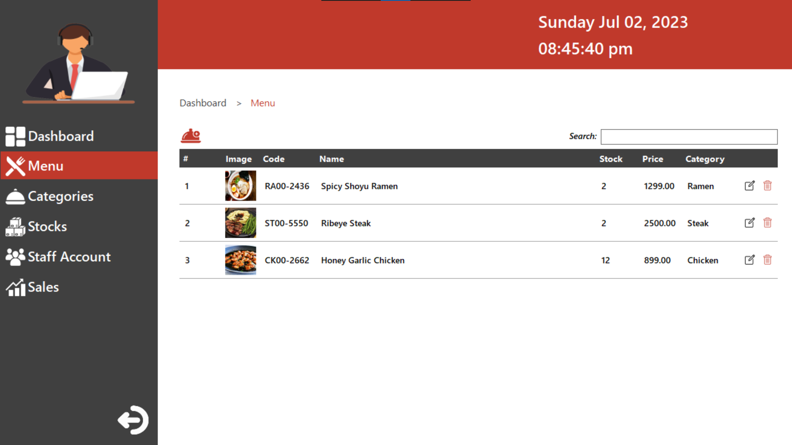&nbsp;&nbsp;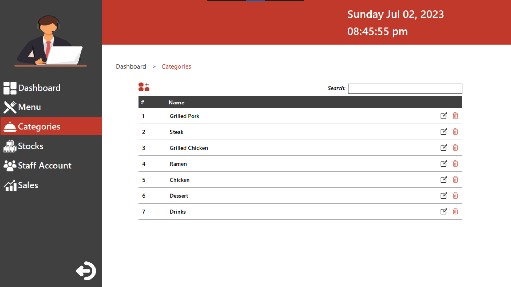</p>
<p align="center">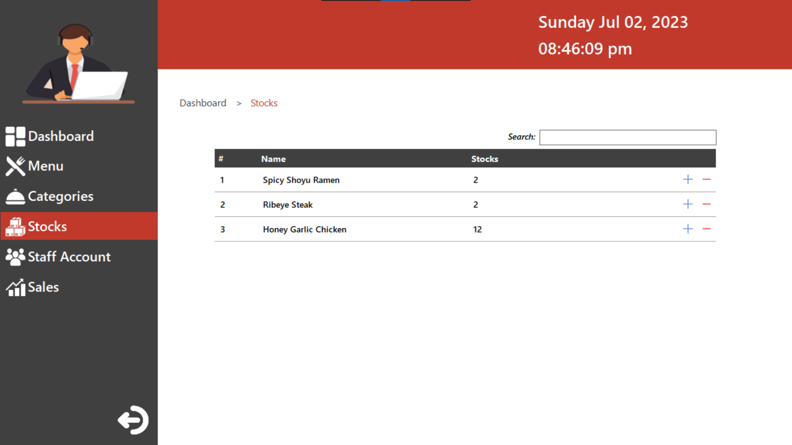&nbsp;&nbsp;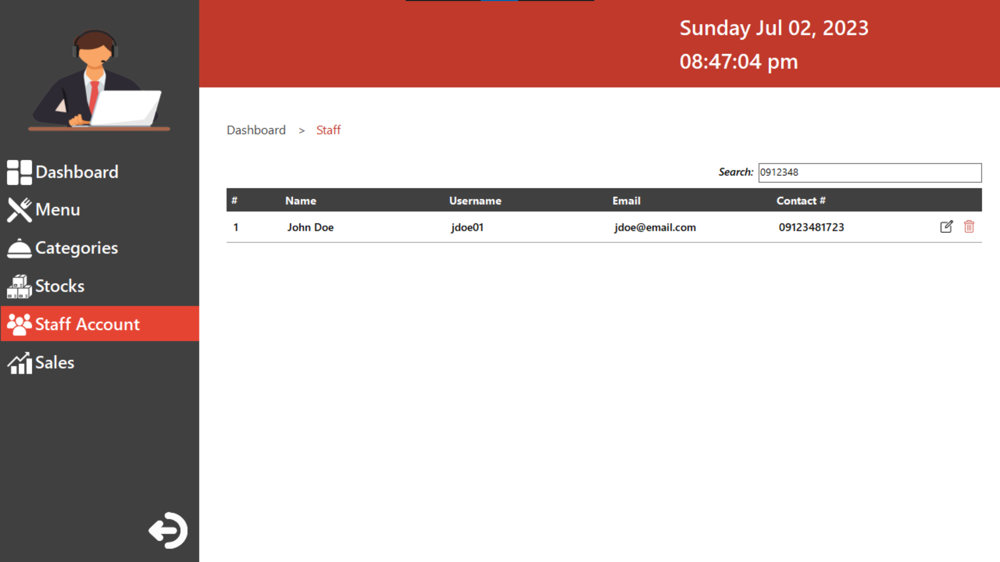</p>
<p align="center">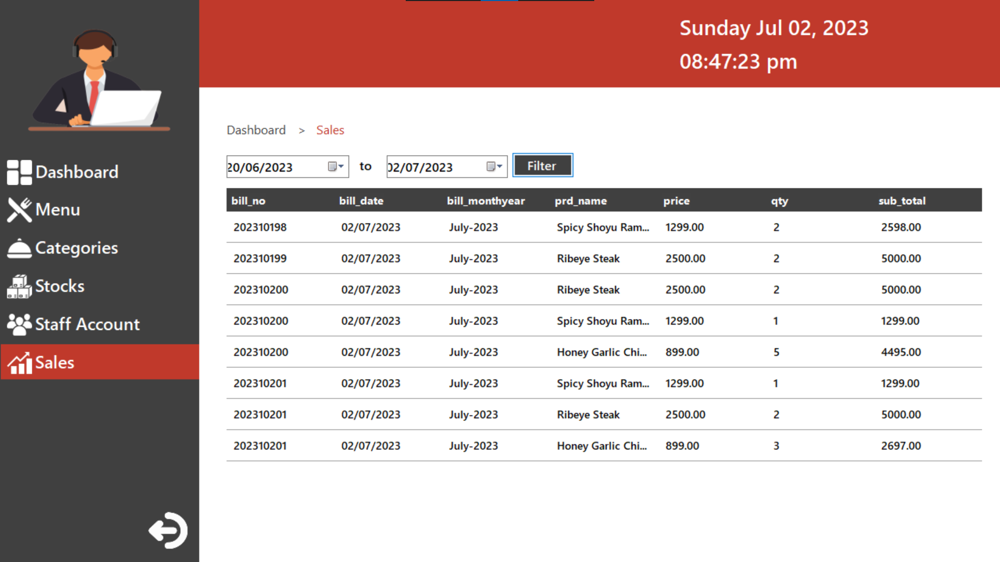</p>

## Getting Started

These instructions will get you a copy of the project up and running on your local machine for development and testing purposes.

## Prerequisites

### What things you need to download and install the system

Xampp -  [https://www.apachefriends.org/](https://www.apachefriends.org/)
Microsoft Visual Studio Code 2019 or Higher - [https://visualstudio.microsoft.com/downloads/](https://visualstudio.microsoft.com/downloads/)


### Installing

A step by step series of examples that tell you how to get a development in your localhost environment

Say what the step will be
```
Clone or download the repository.
```
and
```
Setup the database and create your own resto_system database and
import sql file on sql\resto_system.sql
```


